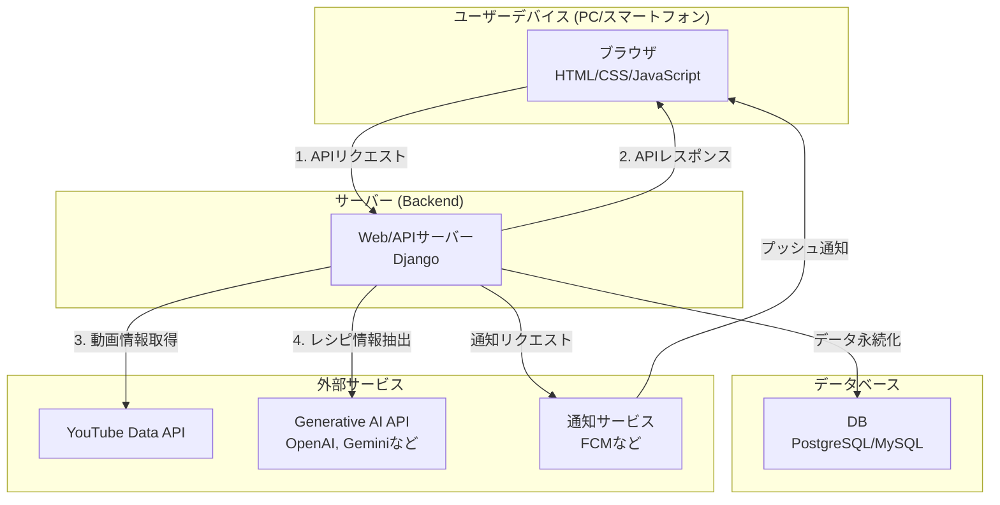
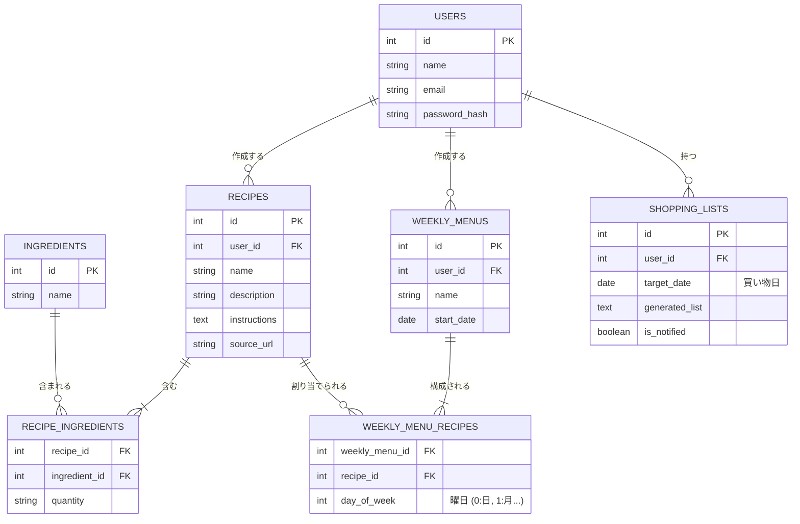
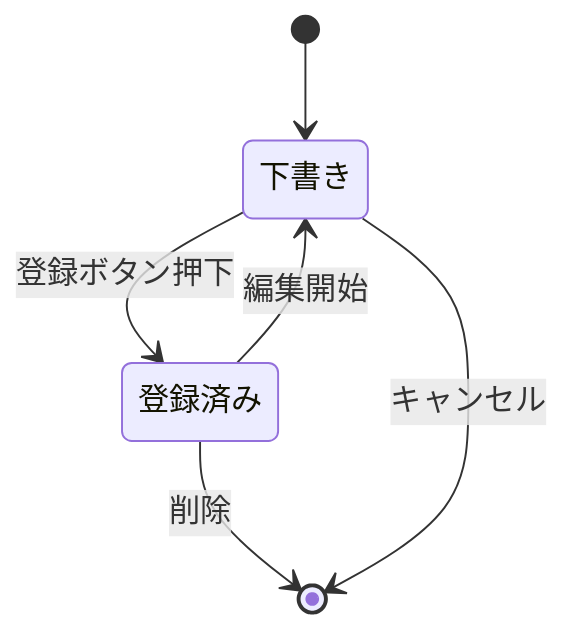
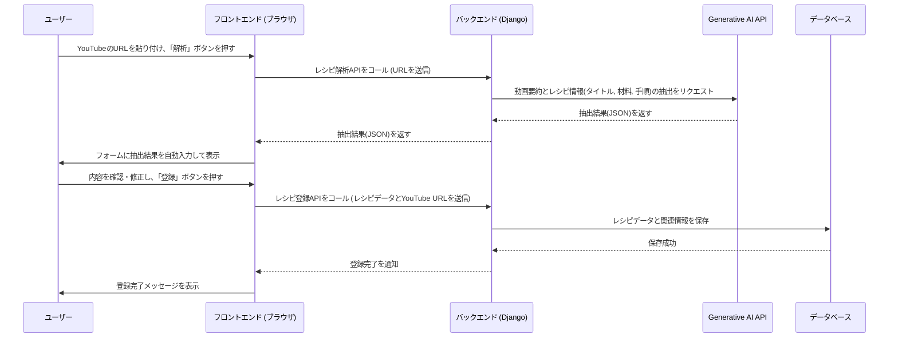
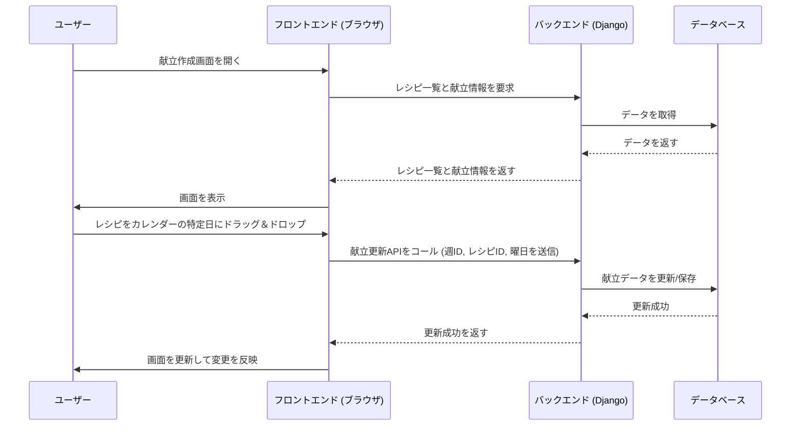
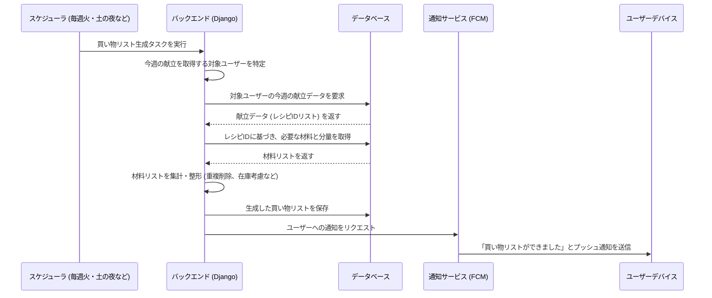
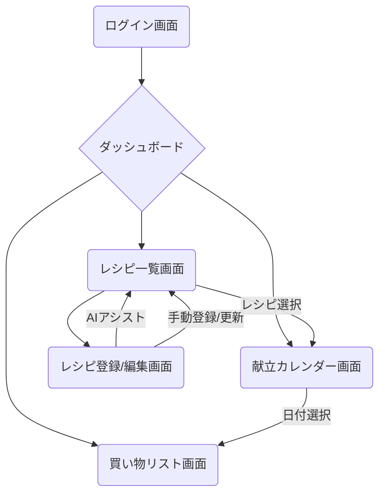

# 献立AIアシスタント 要件定義

## 1. はじめに

本ドキュメントは、Webアプリケーション「献立AIアシスタント」の要件を定義するものです。
日々の献立作成と買い物にかかる手間をAIの力で大幅に削減し、スマートで効率的な食生活をサポートすることを目的とします。

---

## 2. アプリケーション概要

### 2.1. コンセプト

AIによるレシピ情報の自動入力支援、柔軟な献立管理機能、買い物日に連動した買い物リストの自動生成・通知機能を提供します。

- **アプリケーション名（案）**: 献立AIアシスタント
- **コア機能**:
    - AIアシストによるレシピ登録
    - 週・月単位での柔軟な献立作成
    - 買い物日に合わせた買い物リストの自動生成と通知

### 2.2. 主要機能

#### 2.2.1. レシピ管理機能

- **手動登録**: 材料、分量、調理手順などを手入力で登録できます。
- **AIアシスト登録**:
    - YouTube動画のURLを貼り付けると、裏側で**Generative AI API**が動画内容を要約・解析し、**レシピのタイトル、材料、作り方の手順**を自動で抽出します。
    - データベースには抽出された情報と共に、元の**YouTube動画のリンク先**も保存されます。
    - 抽出された内容は入力フォームに自動入力され、ユーザーは確認・修正後に登録できます。
- **レシピ一覧表示**: 登録されたレシピを一覧で確認できます。検索・絞り込み機能も備えます。

#### 2.2.2. 献立作成機能

- **週単位の献立作成**:
    - 登録済みのレシピを組み合わせ、1週間分の献立を1つのまとまりとして作成・管理できます。
    - 各曜日に登録済みのレシピをドラッグ＆ドロップなどで直感的に割り当てられます。
- **月単位の献立作成**:
    - 作成した週単位の献立を複数（例: 4つ）組み合わせることで、月単位の献立を柔軟に作成できます。
    - 過去の献立をコピーして再利用できます。
- **カレンダーでの管理**:
    - 献立はカレンダー形式で視覚的に表示され、週単位・月単位で確認・編集が可能です。

#### 2.2.3. 買い物リスト生成・通知機能

- **自動生成**: 設定された週の献立に基づいて、必要な材料を自動的に集計し、買い物リストを生成します。
- **買い物日の考慮**: 水曜日と日曜日の買い物日を考慮し、その日までに必要な材料をリストアップします。
- **通知機能**: 買い物が必要な日の前日や当日に、買い物リストをプッシュ通知などで知らせます。
- **（オプション）在庫管理**: 自宅にある材料を登録しておき、買い物リストから除外する機能。

### 2.3. 技術スタック

- **フロントエンド**: HTML, CSS, JavaScript (レスポンシブ対応)
    - **フレームワーク/ライブラリ候補**: React, Vue.js, Svelte
- **バックエンド**: Python (Django)
    - **API**: Django REST Framework
    - **AI/MLライブラリ**: spaCy, BeautifulSoup, Transformersなど
- **データベース**: PostgreSQL, MySQLなど
- **AI/MLコンポーネント**:
    - **Generative AI API (例: OpenAI API, Google Gemini APIなど)**
    - 自然言語処理 (NLP)
    - Webスクレイピング
- **API連携**: YouTube Data APIなど
- **通知サービス**: Firebase Cloud Messaging (FCM)など

---

## 3. システム設計

### 3.1. システム構成図

レスポンシブWebデザインを採用し、フロントエンドとバックエンドを分離した構成とします。AIによるレシピ解析は外部のAPIサービスを利用します。

### 3.2. データモデル（ER図）

アプリケーションで扱うデータの関係性を示します。

**補足:**
- 月単位の献立は、複数の`WEEKLY_MENUS`をUI上で束ねて表示することで実現します。
- 買い物リストは、週の献立から必要な材料(`INGREDIENTS`と`RECIPE_INGREDIENTS`)を集計して`SHOPPING_LISTS`にテキスト形式で保存します。
- レシピと材料を1対多（リレーショナルデータベース上では中間テーブルを用いた多対多）の関係で管理することにより、将来的にユーザーの保有食材に基づいたレシピ提案機能の実装が可能になります。

### 3.3. システムの振る舞い（ユースケース別）

#### 3.3.1. ユースケース1: AIアシストによるレシピ登録

##### 状態遷移図 (レシピの状態)

##### シーケンス図

#### 3.3.2. ユースケース2: 週の献立作成

##### シーケンス図

#### 3.3.3. ユースケース3: 買い物リストの自動生成と通知

##### シーケンス図

### 3.4. UI構成図

#### 3.4.1. 画面遷移図

#### 3.4.2. 主要画面のワイヤーフレーム（構成案）

ユーザーが「楽に、楽しく、続けられる」体験ができるよう、UXを意識した画面構成を提案します。

##### 0. ダッシュボード（ログイン後のホーム画面）
ユーザーがアプリを開いたときに最初に目にする画面。献立と買い物の「今」がひと目でわかります。
- **メイン表示**:
    - 「今日の献立」「明日の献立」をカードで表示。
    - 「次の買い物予定（水曜日）」と、そこまでの必要材料をプレビュー表示。
- **ショートカット**:
    - 最も目立つ位置に「AIで新しいレシピを登録する」ボタンを配置。
    - 「献立カレンダーへ」「買い物リスト一覧へ」のナビゲーションボタン。
- **パーソナライズエリア**:
    - 「最近追加したレシピ」や「よく作るレシピ」をリスト表示し、再利用を促します。

##### 1. レシピ一覧画面
見ているだけで楽しくなるような、自分のレシピブックをめくる感覚を目指します。
- **ヘッダー**: ロゴ、グローバルナビゲーション、ユーザーメニュー
- **メインエリア**:
    - **強力な検索・フィルタ**:
        - キーワード検索バー。
        - 「和食」「30分以内」「鶏肉」のようなタグで絞り込むフィルタ。複数選択可能。
    - **レシピカード**:
        - 料理の写真を大きく表示し、タイトルと簡単な説明を記載。
        - カード上に「献立に追加」「お気に入り」ボタンを配置し、一覧から直接アクション可能に。
    - **CTA(行動喚起)ボタン**:
        - 画面右下にフローティングボタンとして「＋ レシピを追加」を常に表示。タップすると「AIで自動作成」「手動で作成」の選択肢が出現。

##### 2. レシピ登録・編集画面
AIの便利さを最大限に体験できる、対話的なUIを目指します。
- **ステップ1: URL入力**:
    - 画面には「YouTubeのURLを貼り付けてください」というシンプルなメッセージと入力欄のみを大きく表示。「手動で入力する」は小さなリンクとして配置。
    - URLをペーストすると「レシピを生成する」ボタンが有効化。
- **ステップ2: AIによる生成と確認**:
    - ボタンを押すと、「AIがレシピを考えています...」などのローディング画面を表示。
    - 生成後は、抽出された「レシピ名」「写真（動画サムネイル）」「材料リスト」「手順」を項目ごとに分けて表示。**各項目はその場で直感的に修正可能**。
    - 材料や手順は、項目の追加・削除・並べ替えがドラッグ＆ドロップで簡単に行える。
- **ステップ3: 仕上げと保存**:
    - 最後に「タグ付け」（例: 和食, 簡単, etc.）やメモ欄を用意。
    - 「この内容でレシピを保存」ボタンを押して完了。

##### 3. 献立カレンダー画面
パズルのようにレシピを組み合わせて、楽しく献立を作成できる画面です。
- **ヘッダー**: 月/週の表示切替ボタン
- **メインエリア (2ペイン構成)**:
    - **左ペイン（レシピバンク）**:
        - 登録済みレシピがコンパクトなカードで一覧表示。検索・フィルタ機能付きで、献立に加えたいレシピをすぐに見つけられる。
    - **右ペイン（カレンダー）**:
        - 週表示または月表示のカレンダー。日付の「朝・昼・晩」の各スロットに、左のレシピをドラッグ＆ドロップで配置。
        - **モバイルの場合は、日付のスロットをタップするとレシピ選択用のポップアップが表示される。**
        - 配置したレシピカードには写真とタイトルが表示され、クリックで詳細を確認できる。
- **フッター/サマリーエリア**:
    - 「この週の買い物リストを見る」ボタンを配置し、ワンタップで買い物リスト画面へ遷移。

##### 4. 買い物リスト画面
実際の買い物のシーンで使いやすい、賢いリストを目指します。
- **ヘッダー**: 対象期間の表示（例: 6/15(日)〜6/18(水)の買い物）、共有ボタン
- **メインエリア**:
    - **カテゴリ別自動分類**:
        - 生成された材料リストを「野菜」「肉・魚」「乳製品」「調味料」のように自動で分類・グループ化して表示。スーパーでの買い物がスムーズに。
    - **スマートな数量集計**:
        - 複数レシピで必要な同じ材料は自動で合算（例: 玉ねぎ1/2個 + 1個 → 玉ねぎ 1.5個）。
    - **インタラクティブなリスト**:
        - 材料名の横にチェックボックスを配置。チェックを入れると、その項目がグレーアウトまたは「購入済み」セクションに移動。
    - **手動追加**:
        - レシピ以外のもの（例: 牛乳、トイレットペーパー）も自由に追加できる入力欄をリストの最後やフローティングボタンで用意。 